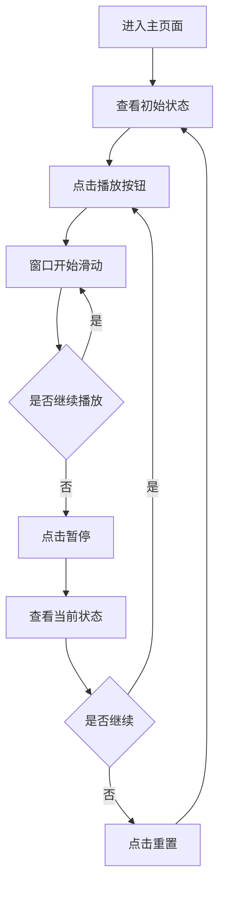

## 1. 产品概述
滑动窗口算法演示网页是一个交互式教育工具，通过动画形式展示滑动窗口算法在数组上的工作原理。用户可以通过播放、暂停、重置和速度控制功能，直观地理解算法的执行过程。

该演示工具面向算法学习者、程序员和学生，帮助他们更好地理解滑动窗口算法的核心概念和应用场景。

## 2. 核心功能

### 2.1 功能模块
我们的滑动窗口算法演示包含以下主要页面：
1. **主演示页面**：算法可视化区域、控制面板、算法说明。

### 2.2 页面详情
| 页面名称 | 模块名称 | 功能描述 |
|-----------|-------------|-------------|
| 主演示页面 | 数组可视化区域 | 显示当前数组状态，高亮显示窗口范围内的元素 |
| 主演示页面 | 滑动窗口动画 | 窗口在数组上移动，实时显示窗口边界变化 |
| 主演示页面 | 控制面板 | 提供播放、暂停、重置按钮和速度调节滑块 |
| 主演示页面 | 算法说明面板 | 显示当前算法步骤说明和代码逻辑 |
| 主演示页面 | 状态信息显示 | 显示当前窗口位置、窗口大小、计算结果等信息 |

## 3. 核心流程
用户操作流程：
1. 用户进入主页面，看到预设的数组和滑动窗口
2. 用户点击播放按钮，观察窗口在数组上滑动
3. 用户可随时暂停动画，查看当前状态
4. 用户可调整播放速度，适应学习节奏
5. 用户可重置演示，重新开始

## 4. 用户界面设计

### 4.1 设计风格
- **主色调**：深蓝色 (#2563eb) 和浅灰色 (#f3f4f6)
- **按钮样式**：圆角矩形，悬停效果
- **字体**：系统默认字体，标题16px，正文14px
- **布局风格**：卡片式布局，中心对齐
- **动画风格**：平滑过渡，使用CSS动画

### 4.2 页面设计概述
| 页面名称 | 模块名称 | UI元素 |
|-----------|-------------|-------------|
| 主演示页面 | 数组可视化区域 | 水平排列的数组元素，每个元素显示为带边框的方块，窗口范围内的元素使用高亮背景色 |
| 主演示页面 | 控制面板 | 底部居中位置，包含播放/暂停按钮（圆形）、重置按钮（矩形）、速度滑块（水平条） |
| 主演示页面 | 算法说明面板 | 右侧边栏，显示算法步骤描述，使用代码高亮显示当前执行的代码行 |
| 主演示页面 | 状态信息 | 顶部显示当前窗口索引、窗口大小、计算结果等关键信息 |

### 4.3 响应式设计
- 桌面端优先设计
- 支持平板和手机自适应
- 触摸交互优化，按钮大小适配移动端