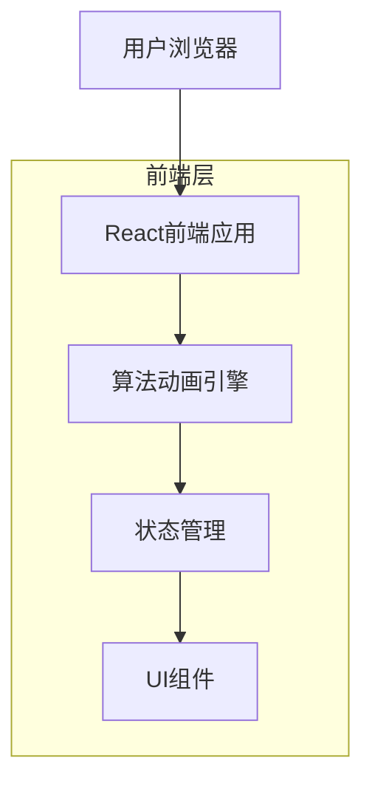
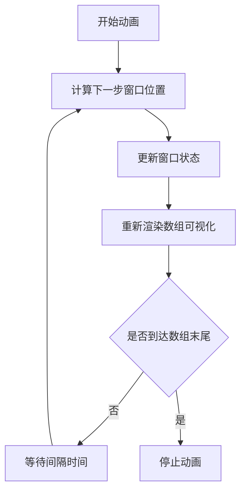

## 1. 架构设计



## 2. 技术描述

- **前端**: React@18 + TailwindCSS@3 + Vite
- **初始化工具**: vite-init
- **后端**: 无（纯前端应用）
- **动画库**: Framer Motion（用于平滑动画效果）
- **状态管理**: React Hooks（useState, useEffect, useRef）

## 3. 路由定义

| 路由 | 目的 |
|-------|---------|
| / | 主演示页面，包含滑动窗口算法可视化 |

## 4. 核心组件结构

### 4.1 主要组件
```typescript
// 数组元素类型
interface ArrayElement {
  value: number;
  index: number;
  isInWindow: boolean;
}

// 窗口状态类型
interface WindowState {
  start: number;
  end: number;
  size: number;
}

// 动画状态类型
interface AnimationState {
  isPlaying: boolean;
  speed: number;
  currentStep: number;
}
```

### 4.2 组件层次结构
- **App**: 主应用组件
  - **Header**: 显示标题和状态信息
  - **ArrayVisualization**: 数组可视化组件
    - **ArrayElement**: 单个数组元素组件
    - **WindowIndicator**: 窗口指示器组件
  - **ControlPanel**: 控制面板组件
    - **PlayButton**: 播放/暂停按钮
    - **ResetButton**: 重置按钮
    - **SpeedControl**: 速度控制滑块
  - **AlgorithmExplanation**: 算法说明组件

## 5. 动画实现逻辑



## 6. 算法演示逻辑

### 6.1 滑动窗口算法步骤
1. 初始化窗口（通常从索引0开始）
2. 处理当前窗口内的元素
3. 滑动窗口到下一个位置
4. 重复步骤2-3直到到达数组末尾

### 6.2 状态管理
使用React的useState管理以下状态：
- 原始数组数据
- 当前窗口位置和大小
- 动画播放状态
- 播放速度
- 当前算法步骤

### 6.3 动画定时器
使用useRef和setTimeout实现可控制速度的动画播放：
```typescript
const animationRef = useRef<NodeJS.Timeout | null>(null);
const speedRef = useRef(speed);

const startAnimation = () => {
  if (animationRef.current) return;
  
  const animate = () => {
    // 更新窗口位置逻辑
    updateWindowPosition();
    
    // 设置下一次动画
    animationRef.current = setTimeout(animate, 1000 / speedRef.current);
  };
  
  animate();
};
```

## 7. 性能优化

- 使用React.memo优化数组元素的重渲染
- 使用useCallback缓存事件处理函数
- 动画帧率根据速度设置自动调整
- 组件卸载时清理定时器避免内存泄漏